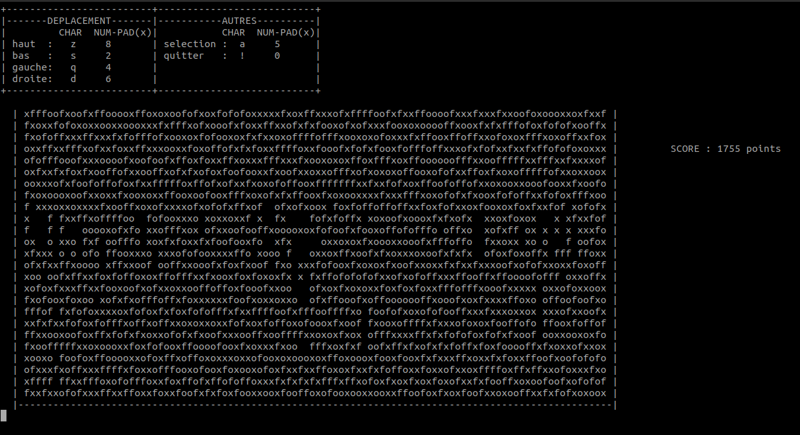

This GitHub repository contains a text-based matching game inspired by popular games like Candy Crush. The game involves matching and removing characters to score points and progress through levels.

## Project Overview

The game is implemented in C. It offers a simple and intuitive interface where players can interact with the game board and make matches by swapping adjacent characters. The objective is to create matches of three or more identical characters in a row or column, which will then be removed, and new characters will fall into place.

## Getting Started

To run the game locally on your machine, follow these steps:

1. Clone this repository to your local machine.
2. Run the game application using the provided command `./ttm.out`.
3. Enjoy playing the text-based matching game!

## Gameplay Instructions

- Use the arrow keys or 8624 keys to navigate the game board.
- Press the 'a' or the '5' to select a character and swap it with an adjacent one.
- Create matches of three or more identical characters in a row or column to score points.

## Contributing

Contributions to this project are welcome. If you have ideas for improvements, new features, or bug fixes, feel free to open a pull request. Please ensure that your contributions align with the project's coding style and follow good software development practices.

## License

This project is licensed under the [MIT License](). Feel free to use, modify, and distribute the code for personal or educational purposes.
